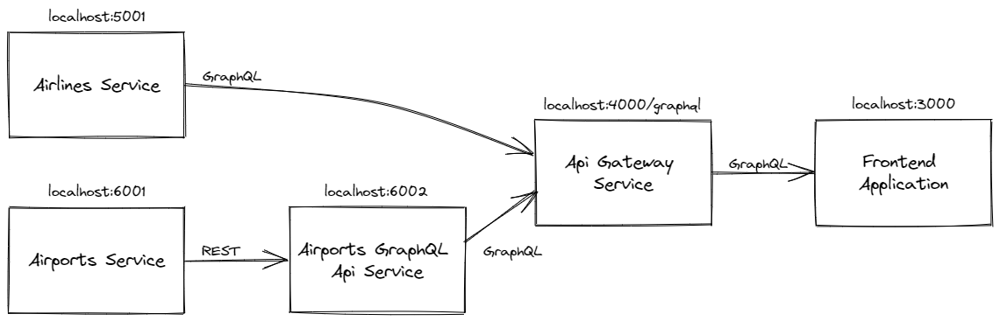

# GraphQL Gateway

GraphQL Gateway is a  repository created in purpose of gathering experience over development of web application consuming GraphQL query language. It is an example of how to create GraphQL server, translate Rest Api into GraphQL Api, merge two GraphQL Apis into one and consume it by Frontend application.

The overall story of an environment covers airline industry - airlines, type of aircrafts and manufacturers, routes, airports, cities and countries.

## Components of an environment

### Airlines service

Backend service exposing GraphQL Api. It covers airline part of domain - manufacturer companies, aircrafts, airlines and their routes. It's stack is based on SQLite, Prisma, Nexus, Typescript and Apollo Server. Head to [Airlines service readme file](/components/airlines-service/README.md) for more details.

### Airports service

Backend service exposing Rest Api. It covers geographical part of domain - countries, cities, airports, and their services. It's simplest JSON Server supported by TypeScript. Head to [Airports service readme file](/components/airports-service/README.md) for more details.

### Airports GraphQL Api service

Backend service responsible for translating and remapping Rest Api exposed by `Airports Service` into GraphQL Api. It's stack is based on Nexus and Apollo Server. Head to [Airports GraphQL Api service readme file](/components/airports-graphql-api/README.md) for more details.

### Api Gateway service

Backend service responsible for merging two GraphQL Apis (exposed by `Airports GraphQL Service` and `Airlines Service`) into one. This layer of architecture might be considered as type-safe an Api gateway for bigger environment or Backend For Frontend layer for frontend application consuming environment's services. It's stack is based on GraphQL Tools and Express. Head to [Api Gateway service readme file](/components/api-gateway/README.md) for more details.

### Frontend application

Frontend application consuming data exposed by `Api Gateway Service`. It displays list of airports as well as details of an airport. It also exposes form for creating an airline. It's stack is based on GraphQL, GraphQL Codegen, Apollo Client, Typescript, Vite, React Router (v.6), React Hook Form (with YUP validation) and Agnostic UI. Head to [Frontend application readme file](/components/frontend/README.md) for more details.

## Available scripts

Project-wise scripts available to fire up in main directory:

### `npm install`

Fires up installation of dependencies and utilities for starting up and managing overall project.

### `npm run install-all`

Fires up installation process for all components available.

### `npm run prepare-all`

Fires up preparation process for all components. Currently it is generating Prisma client for `Airlines Service`.

### `npm run all-components`

Fires up all backend components, frontend application and Prisma Studio for direct manipulations over `Airlines Service` database. Components are available by urls:

- http://localhost:3000 - Frontend application
- http://localhost:4000/graphql/ - GraphQL endpoint exposed by `Api Gateway service`. Using this url in the browser will fire up `GraphiQL` tool for manual issuing GraphQL queries. The tool is provided by `express-graphql`.
- http://localhost:5001/ - GraphQL endpoint exposed by `Airlines Service`. Using this url in the browser will fire up `Apollo Studio` for manual issuing GraphQL queries. The tool is provided by `Apollo`.
- http://localhost:6002/ - GraphQL endpoint exposed by `Airports GraphQL Api Service`. Using this url in the browser will fire up `Apollo Studio` for manual issuing GraphQL queries. The tool is provided by `Apollo`.
- http://localhost:6001/ - Rest endpoint exposed by `Airports Service`. Using this url in the browser will fire up dashboard for exploring endpoints served by `JSON Server`.
- http://localhost:5555 - Prisma Studio for direct manipulations over `Airlines Service` database. The tool is provided by `Prisma`.

### `npm run generate`

Fires up generation of GraphQL schemas across all GraphQL Services and GraphQL Code Generator of frontend application. This is for e2e type safety across components.

Please note that operations on higher components (i.e. `Api Gateway Service` or `Frontend application`) require lower components to be fired up and listening the endpoints exposed. It is recommended to fire up all components in other console first (i.e. by running `npm run all-components` command) and then use this `generate` command.

## Learn more

Below is the list of helpful articles and documentation of tools used to shape the overall project. Please head to each component Readme files to get list of component-specific tools.

- [GraphQL](https://graphql.org/)
- [How to GraphQL](https://www.howtographql.com/) - Reliable tutorial explaining what is GraphQL, and how to use depending on requirements as well as favorite tech-stack.
- [GraphQL tools](https://www.the-guild.dev/graphql/tools) - Set of tools for more advanced using of GraphQL technology.
- [Nexus](https://nexusjs.org/docs/) - Type definition system for GraphQL in TypeScript.
- [Apollo Server](https://www.apollographql.com/docs/apollo-server/) - Server for exposing GraphQL endpoints.
- [GraphQL Code Generator](https://github.com/dotansimha/graphql-code-generator#readme) - Tool for automatic generation of type definitions for frontend applications. Types are based on GraphQL Schema and shape of data consumed by frontend application.